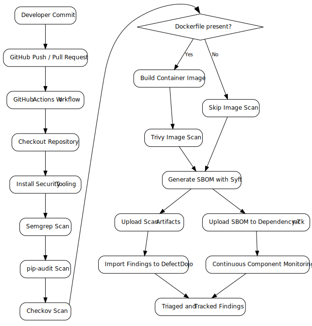

# DevSecOps Software Supply Chain Security Stack Documentation

Welcome to the **documentation hub** for the DevSecOps Software Supply
Chain Security Stack reference architecture.

This documentation explains the architecture, security tooling,
governance model, and operational procedures for implementing a layered
DevSecOps pipeline focused on **software supply chain security**.

The goal of this repository is to demonstrate how modern development
teams can integrate open-source security tooling directly into CI/CD
workflows while maintaining governance visibility across the lifecycle
of software components.

# Documentation Overview

The documentation is organized into conceptual, implementation,
governance, and operational sections.

## Architecture and Design

| Document | Description |
| --- | --- |
| [overview.md](overview.md) | High-level introduction to the DevSecOps architecture |
| [architecture.md](architecture.md) | Detailed system architecture and design |
| [toolchain.md](toolchain.md) | Explanation of the security tools used in the stack |
| [security-architecture-threat-model.md](security-architecture-threat-model.md) | Threat model and security design considerations |

## Implementation

| Document | Description |
| --- | --- |
| [quick-start.md](quick-start.md) | Quick start guide for deploying the stack |
| [github-actions-implementation.md](github-actions-implementation.md) | CI/CD pipeline implementation using GitHub Actions |
| [dependency-track.md](dependency-track.md) | Integration and operation of Dependency-Track |
| [defectdojo.md](defectdojo.md) | Integration and operation of DefectDojo |

## Governance and Compliance

| Document | Description |
| --- | --- |
| [sbom-governance.md](sbom-governance.md) | SBOM lifecycle management and governance |
| [compliance-and-government-contracts.md](compliance-and-government-contracts.md) | Regulatory and government compliance considerations |

## Operations

| Document | Description |
| --- | --- |
| [operations.md](operations.md) | Operational guidance and maintenance |
| [adoption-roadmap.md](adoption-roadmap.md) | Organizational adoption and rollout strategy |

# Architecture Diagrams

Architecture diagrams are maintained in the **docs/diagrams** directory.

These diagrams are stored as Mermaid sources so they remain
version-controlled and editable.

| Diagram | Description |
| --- | --- |
| [devsecops-stack.mmd](diagrams/devsecops-stack.mmd) | Overall DevSecOps security stack architecture |

## CI/CD Security Pipeline Diagram

# Key Concepts Covered

This documentation explains how to implement:

- Static Application Security Testing (SAST)
- Dependency vulnerability scanning
- Infrastructure-as-Code security validation
- Container vulnerability scanning
- Software Bill of Materials (SBOM) generation
- Software supply chain monitoring
- Centralized vulnerability management

Together these components create a **defense-in-depth DevSecOps security architecture**.

# Recommended Reading Order

For readers new to the architecture, the recommended reading sequence
is:

1.  [overview.md](overview.md)
2.  [architecture.md](architecture.md)
3.  [toolchain.md](toolchain.md)
4.  [quick-start.md](quick-start.md)
5.  [github-actions-implementation.md](github-actions-implementation.md)
6.  [sbom-governance.md](sbom-governance.md)
7.  [operations.md](operations.md)

# Relationship to the Repository

This documentation complements the rest of the repository structure:

    docs/        → architecture and operational documentation
    deploy/      → Docker deployment configuration
    scripts/     → automation utilities used by the pipeline
    .github/     → CI/CD security pipeline definition
    examples/    → example projects demonstrating integration

# License

Apache License 2.0
